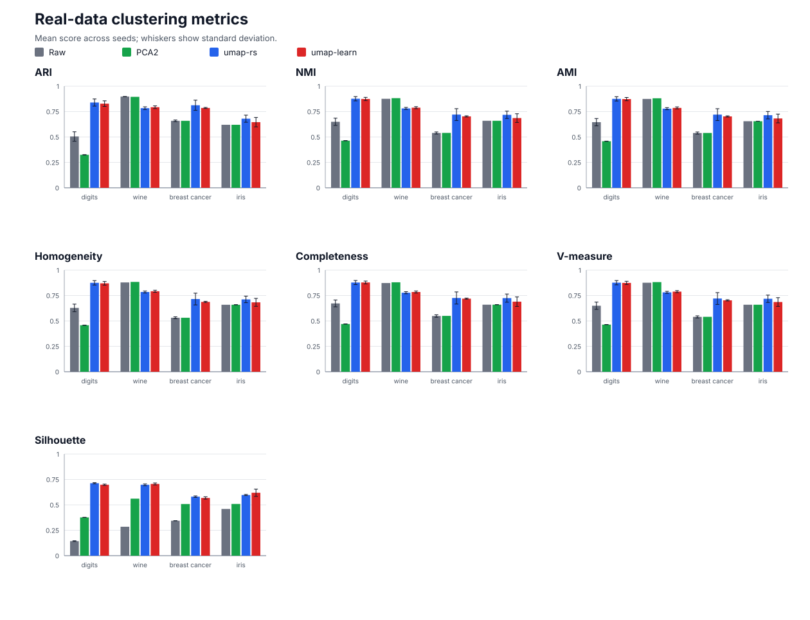
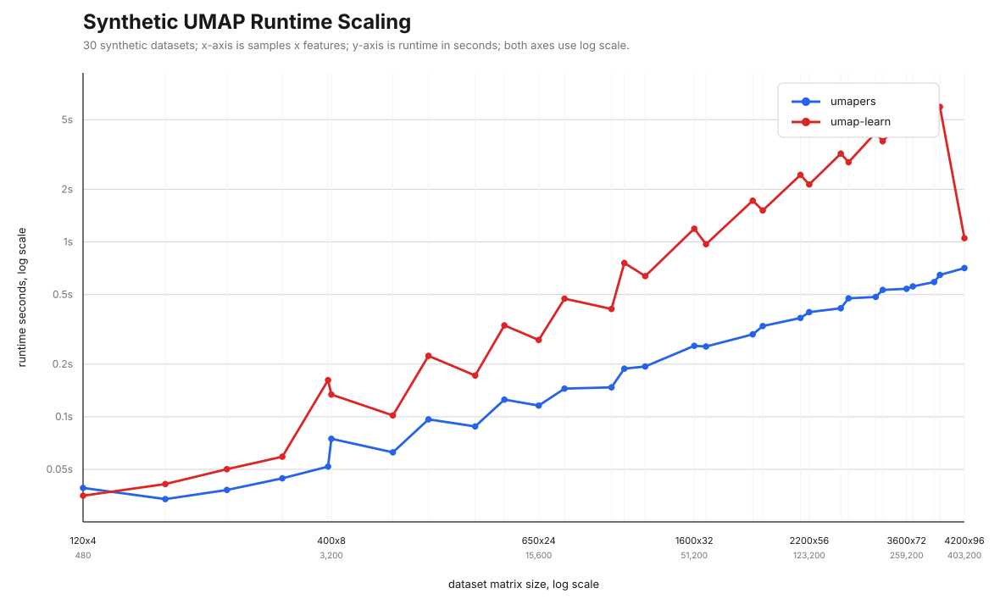
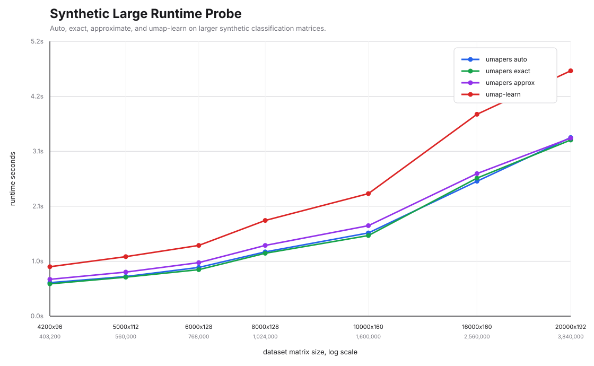
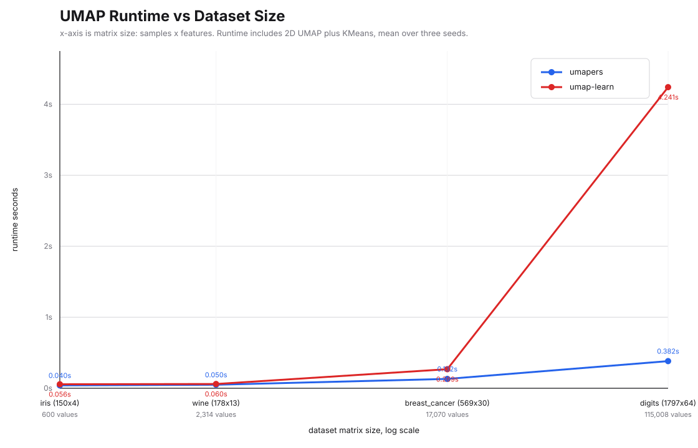
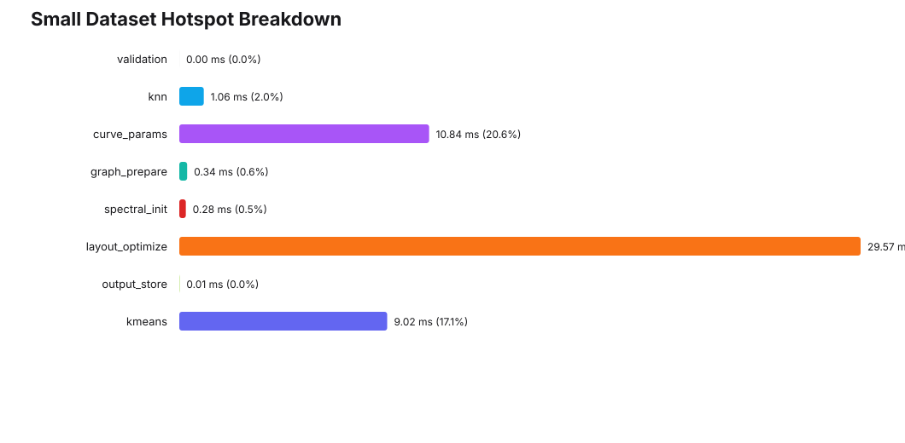

# umapers

[English Version](README.md)

`umapers` 是一个 Python UMAP 库，用于降维、聚类工作流和 embedding 可视化。

`umap-learn` 是 Python 生态中广泛使用的 UMAP 实现，本项目把它作为兼容性评估和基准测试的参照。对于本包暴露的同名参数和工作流，`umapers` 尽量采用用户熟悉的语义；拟合和样本变换由本包自己的计算路径完成，不在运行时调用 `umap-learn`。

当前报告显示，在已测试真实数据集上，`umapers` 的下游聚类质量接近 `umap-learn`；在已测试的中大型合成数据上，运行时间更短。很小的数据集上固定开销占比更高，不一定更快。

## 安装

```bash
pip install umapers
```

可选绘图和诊断工具：

```bash
pip install "umapers[plot,diagnostics]"
```

从源码构建：

```bash
pip install --upgrade pip maturin
maturin develop --release --manifest-path umap_rs/Cargo.toml
```

## 快速开始

```python
import numpy as np
from umapers import Umap

x = np.random.default_rng(42).normal(size=(1000, 32)).astype(np.float32)

model = Umap(
    n_neighbors=15,
    n_components=2,
    n_epochs=200,
    random_seed=42,
)

embedding = model.fit_transform(x)
print(embedding.shape)  # (1000, 2)
```

拟合一次，再变换新样本：

```python
model = Umap(random_seed=42).fit(x)
query_embedding = model.transform(x[:10])
```

如果希望类别标签影响 embedding，可以使用 categorical supervised UMAP：

```python
labels = np.random.default_rng(7).integers(0, 4, size=x.shape[0])

embedding = Umap(
    target_metric="categorical",
    target_weight=0.5,
    random_seed=42,
).fit_transform(x, y=labels)
```

安装可选绘图依赖后，可以直接画二维 embedding：

```python
from umapers.plot import points

ax = points(embedding, labels=labels, s=8)
ax.figure.savefig("embedding.png", dpi=160)
```

## 效果

下面的图来自 `1.1.1` 发布报告。

### 聚类质量

真实数据报告在 digits、wine、breast cancer、iris 上对比 raw features、PCA2、`umapers` 和 `umap-learn`。UMAP 本身按无监督方式运行；随后在每种表示上用已知类别数运行 KMeans，并统计 ARI、NMI、AMI、homogeneity、completeness、V-measure 和 silhouette。



详细报告：[`reports/current_clustering_analysis_report.md`](reports/current_clustering_analysis_report.md)

在这些数据集上，`umapers` 和 `umap-learn` 的下游聚类质量接近。

### 运行时间缩放

合成数据报告使用 30 个规模递增的数据集，用来观察拟合时间的缩放情况。



详细报告：[`reports/synthetic_runtime_scaling_report.md`](reports/synthetic_runtime_scaling_report.md)

大数据探针把规模推到 20,000 x 192，并记录 `umapers` 自动选择的近邻策略。



详细报告：[`reports/synthetic_large_runtime_probe.md`](reports/synthetic_large_runtime_probe.md)

真实数据运行时间图使用 sklearn 数据集，并包含聚类流程里的 KMeans 步骤。



详细报告：[`reports/runtime_vs_dataset_size.md`](reports/runtime_vs_dataset_size.md)

小数据集开销单独列出，因为固定成本在这类数据上最明显。



详细报告：[`reports/small_dataset_hotspot_report.md`](reports/small_dataset_hotspot_report.md)

功能覆盖情况见 [`reports/current_feature_parity_report.md`](reports/current_feature_parity_report.md)。

## 支持的工作流

| 需求 | API |
|---|---|
| 拟合 2D 或 nD embedding | `Umap(...).fit_transform(data)` |
| 拟合一次，再变换新样本 | `model.fit(data)` 后 `model.transform(query)` |
| 近似逆变换 | `model.inverse_transform(embedding)` |
| 分类监督 embedding | `target_metric="categorical"`，传入 `y=` |
| dense densMAP 半径输出 | `densmap=True`，`output_dens=True` |
| 稀疏输入 | CSR/CSC/COO 输入传给 `fit` 或 `fit_transform` |
| 绘制 embedding | `umapers.plot.points(...)` |
| 计算 trustworthiness | `umapers.diagnostics.trustworthiness_report(...)` |
| 复用预计算 kNN 图 | `Umap.fit_transform_with_knn(...)` |
| Parametric 便捷工作流 | `ParametricUmap` |
| Aligned 便捷工作流 | `AlignedUmap` |

## 常用示例

### 稀疏输入

```python
from scipy import sparse
from umapers import Umap

x_sparse = sparse.random(5000, 2000, density=0.01, format="csr", random_state=42)
embedding = Umap(metric="cosine", random_seed=42).fit_transform(x_sparse)
```

CSR 输入可以直接使用。CSC 和 COO 输入在可用时会通过 `.tocsr()` 转换。

### 密度输出

```python
model = Umap(densmap=True, output_dens=True, random_seed=42)
embedding, original_radii, embedding_radii = model.fit_transform(x)
```

### Trustworthiness

```python
from umapers.diagnostics import trustworthiness_report

report = trustworthiness_report(x, embedding, n_neighbors=15)
print(report["trustworthiness"])
```

### 复用 kNN 图

```python
import numpy as np
from sklearn.neighbors import NearestNeighbors
from umapers import Umap

k = 15
nbrs = NearestNeighbors(n_neighbors=k + 1, metric="euclidean").fit(x)
dists, idx = nbrs.kneighbors(x)

embedding = Umap(n_neighbors=k, random_seed=42).fit_transform_with_knn(
    x,
    idx[:, 1 : k + 1].astype(np.int64),
    dists[:, 1 : k + 1].astype(np.float32),
    knn_metric="euclidean",
)
```

## 已知限制

截至 `1.1.1`：

- 暂不支持稀疏数据训练后的 `inverse_transform`
- `ParametricUmap` 是轻量便捷工作流，不是 Keras/TensorFlow 替代品
- `AlignedUmap` 只覆盖 `umap-learn` 的一部分 relation mode
- 近似近邻行为与 `pynndescent` 不完全一致
- 任意预计算图还没有作为通用公共 API 暴露

如果你的项目依赖其中某条路径，建议保留 `umap-learn` 作为基线，并在自己的数据上验证。

## 复现报告

```bash
scripts/validate_release.sh

python benchmarks/current_clustering_analysis_report.py
python benchmarks/synthetic_runtime_scaling_report.py
python benchmarks/synthetic_large_runtime_probe.py
python benchmarks/small_dataset_hotspot_report.py
python benchmarks/current_feature_parity_report.py
```

`scripts/validate_release.sh` 会运行 Rust 测试、clippy、release 模式 Python 扩展构建，以及 Python binding 测试。

## Rust 用户

Rust crate 和 CLI 见 [`rust_umap/README.md`](rust_umap/README.md)。
